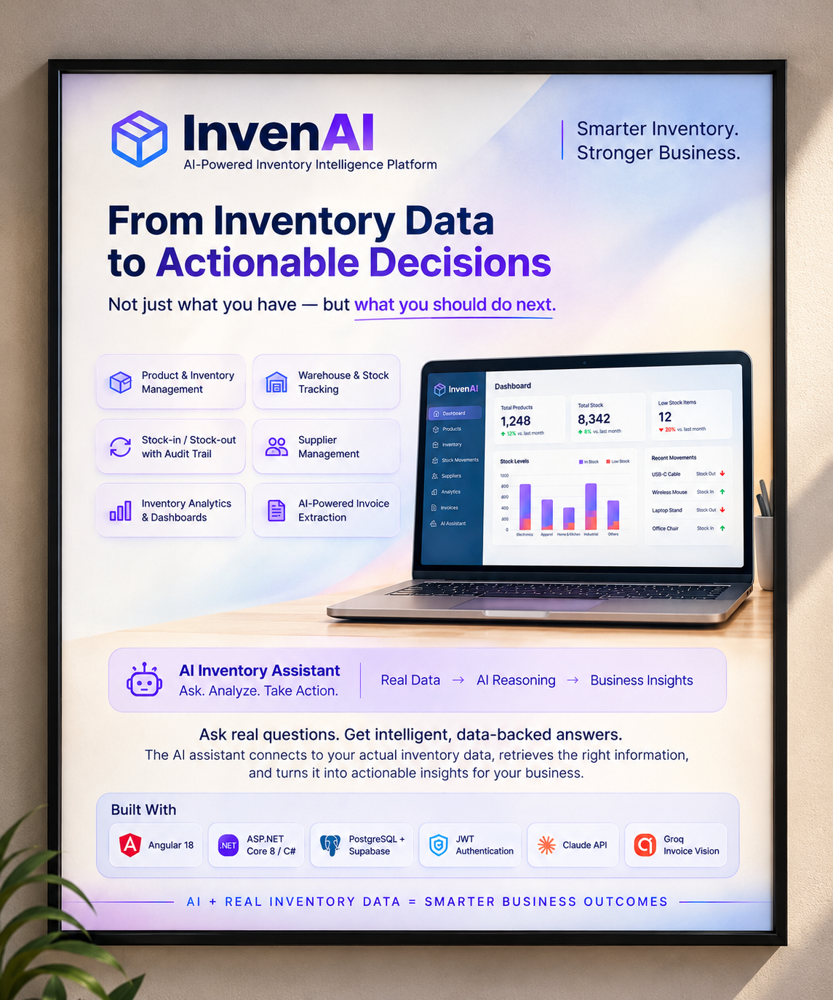

# AI-Powered Inventory Management System

A focused, modular inventory management web app — not a full ERP.

- **Frontend:** Angular 18 (standalone components), HTML5, CSS3
- **Backend:** C# / ASP.NET Core 8 Web API
- **Database:** Supabase PostgreSQL (only)
- **AI:** InvenChat — free, open-source LLM (via Groq's fast inference API) doing text-to-SQL over the Supabase schema
- **Maps:** Leaflet + OpenStreetMap for shipment tracking, OSRM for real road routing, Nominatim for address search — all free, open-source, no API key or billing
- **Automate Workflow:** an in-process background service polls Alert/Trigger/Supply-Chain workflows and emails via Gmail SMTP (a free App Password — no email API/billing)
- **Auth:** JWT (email + password, BCrypt-hashed)

```
InventoryApp/
├── backend/InventoryApi/       # ASP.NET Core Web API (open in Visual Studio)
├── frontend/inventory-app/     # Angular app (open in VS Code)
└── database/                   # SQL scripts to run in Supabase
```

---

## 1. Set up Supabase (PostgreSQL)

1. Create a free project at https://supabase.com.
2. Go to **Project Settings → Database** and copy your connection string / password. Also note your **Project Reference** (the `xxxx` in `xxxx.supabase.co`).
3. Open the **SQL Editor** in Supabase and run, in order:
   - `database/01_schema.sql` — creates all tables, constraints, indexes, triggers.
   - `database/02_seed.sql` — optional sample data (products, suppliers, stock, and a demo admin login).
   - `database/04_invoices.sql` — Invoice Extractor storage.
   - `database/05_chat_history.sql` — Chat conversation history (`chat_conversations`, `chat_messages`).
   - `database/06_shipments.sql` — Shipment tracking (`shipments`).
   - `database/07_package_orders.sql` — Package Orders (`package_orders`, `package_order_items`).
   - `database/08_workflows.sql` — Automate Workflow (`workflows`, `workflow_events`).

The seed script creates a default login:
- **Email:** `admin@inventory.local`
- **Password:** `Admin@123`

> You can skip the seed script and just register a new user from the Angular login screen instead — registration is open (`POST /api/auth/register`).

---

## 2. Configure and run the backend (Visual Studio)

**Requirements:** .NET 8 SDK (the runtime alone isn't enough — `dotnet build`/`dotnet run` need the SDK; grab it from https://dotnet.microsoft.com/download if `dotnet --version` fails), Visual Studio 2022 Community (or the `dotnet` CLI).

Open the solution via **`backend/InventoryApi.sln`** (not the folder, and not the bare `.csproj`) — that's what gives Visual Studio a startup project to run/debug with F5.

### Supabase connection: use the pooler, not the direct host

Supabase's **direct** connection (`db.<project-ref>.supabase.co:5432`) is frequently unreachable from restrictive networks/firewalls — many ISPs block outbound port 5432 outright. Use the **Transaction pooler** instead: Supabase dashboard → **Project Settings → Database → Connection string → Transaction pooler** (port `6543`, host like `aws-0-<region>.pooler.supabase.com`, username `postgres.<project-ref>`).

The pooler also requires two extra Npgsql flags — PgBouncer's transaction mode doesn't support prepared statements, and Npgsql auto-prepares by default, which causes intermittent `"An exception has been raised that is likely due to a transient failure"` errors on some queries otherwise:

```
Max Auto Prepare=0;No Reset On Close=true
```

### Secrets: two appsettings files, only one is committed

- **`appsettings.json`** (committed to git) holds only placeholder values — safe as a template.
- **`appsettings.Development.json`** (git-ignored — see `.gitignore`) holds your real DB password and JWT secret. ASP.NET Core automatically layers this over `appsettings.json` when `ASPNETCORE_ENVIRONMENT=Development`, which is the profile set up in `Properties/launchSettings.json`.

Create `appsettings.Development.json` next to `appsettings.json` (it won't exist on a fresh clone, since it's git-ignored) with:

```json
{
  "ConnectionStrings": {
    "SupabaseConnection": "Host=aws-0-<region>.pooler.supabase.com;Port=6543;Database=postgres;Username=postgres.<project-ref>;Password=YOUR-DB-PASSWORD;SSL Mode=Require;Trust Server Certificate=true;Max Auto Prepare=0;No Reset On Close=true"
  },
  "Jwt": {
    "SecretKey": "REPLACE_WITH_A_LONG_RANDOM_SECRET_AT_LEAST_32_CHARS"
  },
  "Groq": {
    "ApiKey": "REPLACE_WITH_YOUR_GROQ_API_KEY",
    "Model": "qwen/qwen3.6-27b"
  },
  "Email": {
    "Username": "REPLACE_WITH_YOUR_GMAIL_ADDRESS",
    "AppPassword": "REPLACE_WITH_YOUR_GMAIL_APP_PASSWORD"
  }
}
```

- **Jwt:SecretKey**: any long random string (32+ characters). Used to sign login tokens.
- **Groq:ApiKey**: powers both the **Invoice Extractor**'s vision extraction and **InvenChat** (free tier). Get a key at https://console.groq.com → API Keys. `Groq:Model` (`qwen/qwen3.6-27b`) is the vision-capable model used for invoices; `Groq:ChatModel` (defaults to the same `qwen/qwen3.6-27b`) is the text model InvenChat uses for SQL generation and answers — if either is greyed out for your account, enable it at **console.groq.com → Settings → Limits** first (org-level model permissions are opt-in). Without a Groq key, the Invoice Extractor's "Scan Invoice" flow and InvenChat will both return an error explaining what's missing; every other feature works fine regardless.
- **Email:Username / Email:AppPassword**: powers the **Automate Workflow** module's emails (free, via Gmail SMTP — no email API/billing). Enable **2-Step Verification** on the sending Gmail account, then generate a 16-character App Password at https://myaccount.google.com/apppasswords and use that (not your normal Gmail password) as `AppPassword`. Without these configured, workflows still run and log their activity, but each email attempt is recorded as `EmailFailed` in the workflow's timeline instead of actually sending.

### Run

- In Visual Studio: pick the **http** launch profile from the dropdown (not "IIS Express") and press **F5** (or `Ctrl+F5`).
- Or via CLI: `cd backend/InventoryApi && dotnet run`.

The API listens on **`http://localhost:5000`** (see `Properties/launchSettings.json`). It does **not** auto-open a browser tab — Swagger UI is still available at `http://localhost:5000/swagger` in development mode if you want to browse/test endpoints manually, it's just not launched for you automatically.

The app uses EF Core against your Supabase Postgres — no local database is needed. Tables must already exist (from step 1); EF Core does **not** auto-create them, by design, so schema stays fully controlled via SQL scripts.

---

## 3. Configure and run the frontend (VS Code)

**Requirements:** Node.js 18+, Angular CLI (`npm install -g @angular/cli`).

1. Open the `frontend/inventory-app` folder in VS Code.
2. Install dependencies:

```bash
cd frontend/inventory-app
npm install
```

3. Point the app at your backend API — edit `src/environments/environment.ts`:

```ts
export const environment = {
  production: false,
  apiUrl: 'http://localhost:5000/api'   // match your backend's actual port (see Properties/launchSettings.json)
};
```

4. Run the dev server:

```bash
npm start
```

5. Open `http://localhost:4200`. Log in with the seeded admin account, or register a new user.

---

## 4. What's included

### Product Management
Create, edit, delete, and view products (name, SKU, category, unit price, minimum stock level, status), with reactive-form validation and duplicate-SKU protection.

### Inventory & Stock Management
- Current stock per product per warehouse.
- Stock-in, stock-out, and manual adjustments — each writes a `stock_movements` row, so you get a full audit trail.
- Movement history view with filters.

### Supplier Management
Full CRUD, with lead time (days), contact info, and product associations. Suppliers linked to active products can't be deleted until reassigned (data integrity).

### Inventory Dashboard
Total products, total inventory value, low-stock count, recent movements, and a category-value breakdown chart — plus search/filter controls throughout the product/inventory/supplier screens.

### InvenChat (AI, free & open-source)
A floating chat button (bottom-left, on every page) plus a dedicated `/chat` page. Powered by a free, open-source LLM (`qwen/qwen3.6-27b`) running on [Groq](https://console.groq.com)'s fast inference hardware — no Anthropic/OpenAI, same free API key already used by the Invoice Extractor. The chain is:

```
User question
   → Groq LLM generates a read-only SQL SELECT against the known Supabase schema
   → Query validated (SELECT-only, no semicolons/DDL/DML keywords) and run inside
     a rolled-back, read-only transaction with a statement timeout
   → Groq LLM turns the resulting rows into a concise, business-oriented answer
   → Rendered in the Angular chat widget / InvenChat page
```

Because the SQL is generated per-question, InvenChat can answer open-ended questions across any of the tables (products, suppliers, warehouses, inventory, stock movements, categories) rather than being limited to a fixed set of intents. It never runs anything but `SELECT`, and every query executes inside a transaction that is always rolled back, so it cannot mutate data.

**Conversation history:** every question and answer is saved per-user to `chat_conversations`/`chat_messages` (`database/05_chat_history.sql`). The `/chat` page shows a history sidebar (left) — click "+ New chat" to start fresh or click a past conversation to reopen its full Q&A history; conversations are private per user and titled from their first question.

### Invoice Extractor
Photograph or upload an invoice (mobile camera capture via `capture="environment"`, or gallery/file picker) and have it read automatically:

```
Photo (compressed client-side to ≤1600px JPEG)
   → Groq vision model (qwen/qwen3.6-27b) — structured JSON extraction
   → Editable preview (vendor, line items, tax, totals — fix any AI mistakes before committing)
   → Save: server renders a formatted PDF (QuestPDF) and stores it as bytea in Supabase Postgres
     — or — Discard: nothing is saved
```

A "Saved Invoices" tab lists everything saved, with PDF download and delete. No separate object storage is used — the generated PDF lives directly in the `invoices` table alongside the extracted data (`database/04_invoices.sql`).

### Package Orders
Reserve products from a specific warehouse ahead of shipping them — the bridge between Inventory and Shipments:

```
Pick a warehouse + one or more products, each with a quantity and an optional
free-text customization note (a "tallied" variant of that product — e.g. "blue,
engraved, gift-wrapped" — still counted against the same stock, just annotated)
   → Stock is validated per product (aggregated across duplicate lines) and, if
     sufficient, deducted immediately as a stock_movements OUT entry per line
     (database/07_package_orders.sql) — same mechanism as a manual inventory movement
   → Order sits Pending until it's linked to a shipment
   → Cancelling a Pending order reverses the deduction (an IN movement restocks it)
```

The **Package Orders** list (`/package-orders`) shows every order with status, priority, and item/quantity counts. **New Package Order** (`/package-orders/new`) lets you add any number of line items, each an existing product + quantity + optional customization note, plus order-level priority/notes/expected ship date. The detail page shows the full line-item breakdown and, once shipped, links straight to the live-tracking shipment.

### Shipments (live map tracking)
Create a shipment order from any two points and watch it move on a real map — fully free/open-source, no Google Maps or billing involved. A shipment can optionally carry a **Pending Package Order** (linked from the New Shipment page, or via "🚢 Ship this Order" on a package order's detail page) — selecting one auto-fills the origin from its warehouse and marks the package order **Shipped** once the shipment is created (deleting the shipment frees it back to Pending):

```
Pick origin + destination (address search via Nominatim, or click/drag pins on the map) —
optionally auto-filled from a linked Package Order's warehouse
   → Server asks OSRM (free public routing API) for the real road route, distance, and ETA
   → Route + timings stored once (database/06_shipments.sql)
   → Live map (Leaflet + OpenStreetMap tiles) draws the route and animates a truck marker
     along it in real time, based on elapsed time vs. estimated arrival
   → Status auto-transitions InTransit → Delivered when the ETA passes (or mark
     Delivered/Cancelled manually at any time)
```

The **Shipments** list (`/shipments`) shows every order with a live progress bar and status badge (polls every 15s), plus which package order (if any) it's carrying. **New Shipment** (`/shipments/new`) is a two-pane picker: address autocomplete + "pick on map" + draggable pins for both origin and destination. The **detail page** (`/shipments/:id`) shows the live-animated map alongside an elapsed/remaining countdown timer that ticks every second — no backend polling needed for the timer itself, since progress is derived purely from `startedAt`/`estimatedArrivalAt` on the client.

### Automate Workflow
Three kinds of automation, each set up through an animated node-by-node wizard (styled like n8n/Jenkins) and executed by an in-process background service (`WorkflowExecutionService`) that polls every few minutes — no separate job infrastructure:

- **Alert workflow** — pick a warehouse (and optionally one specific product; if none, every product there is watched individually) and a threshold. The moment any watched product's quantity on hand drops below the threshold, a Gmail alert fires to the configured recipient. Edge-triggered: it only emails on the *transition* into breach, not every polling cycle, and re-arms automatically once stock recovers above the threshold.
- **Trigger workflow** — pick an existing Pending **Package Order**, a scheduled ship date/time, and an origin/destination (auto-suggested from the order's warehouse). At the scheduled time the engine automatically creates the shipment (exactly like using New Shipment by hand) and marks the package order Shipped; once that shipment reaches Delivered or Cancelled, it emails a completion report (route, distance, timestamps, final status) to the configured recipient.
- **Supply Chain workflow** — pick a product + warehouse pairing to monitor continuously. Combines the Alert workflow's low-stock emailing with shipment tracking: it also emails whenever a shipment carrying a package order with that product (from that warehouse) reaches Delivered or Cancelled — end-to-end visibility on one screen.

```
Create Workflow → pick a type (3 animated node-style options) → configure every
parameter through connected "node" cards (warehouse/product/threshold/email, or
package order/schedule/route/email) → Activate
   → Workflow.Config (JSON) captures the setup once; Workflow.State (JSON) is the
     background engine's own bookkeeping (which products are currently breached,
     which shipments have already been reported on) so nothing double-fires
   → WorkflowExecutionService polls all Active workflows (Workflows:PollingIntervalMinutes,
     default 3) and acts: sends email via Gmail SMTP, and/or calls ShipmentService directly
   → Every action is logged to workflow_events, shown as an activity timeline on the
     workflow's detail page
```

The **Automate Workflow** list (`/workflows`) shows every workflow's type, live status, and a human-readable summary; "+ Create Workflow" opens the three-option animated picker. Workflows can be paused/resumed/deleted at any time from their detail page.

---

## 5. Project structure reference

**Backend** (`Controllers → Services → EF Core/Supabase`):
```
Controllers/     ProductsController, SuppliersController, InventoryController, WarehousesController,
                 DashboardController, ChatController, AuthController, CategoriesController, InvoicesController,
                 ShipmentsController, PackageOrdersController, WorkflowsController
Services/        ProductService, SupplierService, CategoryService, WarehouseService, InventoryService, DashboardService,
                 ChatService, AuthService, InvoiceExtractionService, ShipmentService, PackageOrderService,
                 WorkflowService, WorkflowExecutionService (BackgroundService), EmailService (+ Interfaces/)
DTOs/            Request/response contracts, kept separate from entities
Models/          EF Core entities
Data/             InventoryDbContext (maps entities to snake_case Supabase tables)
Middleware/      ExceptionMiddleware (global error handling -> consistent JSON errors)
```

**Frontend** (`core/ shared/ features/...`):
```
core/            AuthService, JWT interceptor, error interceptor, ApiService, auth guard, layout
shared/          Cross-feature models + reusable components (loading spinner, etc.)
features/
  auth/          Login/register
  products/      List + create/edit form
  inventory/     Stock view, movement history, movement form
  suppliers/     List + create/edit form
  categories/    List + create/edit form
  warehouses/    List + create/edit form
  invoices/      Invoice Extractor — camera/gallery capture, AI preview, save/discard, saved-invoices list
  dashboard/     Summary cards, charts, heatmap, low-stock table, recent movements
  chat/          Chat window, floating widget, dedicated /chat page + service
  package-orders/  List, create (product + warehouse picker with customization notes), detail + cancel
  shipments/     List, create (address search + map picker + package-order linking), live-tracking detail page, map component
  workflows/     List + 3-option animated picker, one node-wizard component per type, detail page with activity timeline
```

---

## 6. Extending the app

- **InvenChat behavior:** tune the SQL-generation and answer-summarization prompts in `ChatService.cs`, or swap the model via `Groq:ChatModel` in `appsettings.json` (any model enabled for your Groq account works — bigger/instruction-tuned models generally write better SQL).
- **Shipments:** the routing backend is `Osrm:BaseUrl` in `appsettings.json` (defaults to the free public `router.project-osrm.org` demo server — fine for development/demo traffic, but swap in a self-hosted OSRM instance for real production volume, since the public one is rate-limited and not meant for heavy use). The average-speed fallback used when OSRM is unreachable lives in `ShipmentService.StraightLineFallback`.
- **Package Orders:** the "tallied product" customization is currently a free-text note per line item (`PackageOrderItem.CustomizationNote`) — swap in structured attributes (e.g. a `product_customizations` table with typed key/value pairs) if you need those to be queryable or reportable later.
- **Automate Workflow:** `Workflows:PollingIntervalMinutes` in `appsettings.json` controls how often `WorkflowExecutionService` checks Active workflows (default 3 — lower it for snappier alerts during testing, e.g. via the `Workflows__PollingIntervalMinutes` environment variable). Since this runs in-process, it only executes while the API is running; for a real always-on deployment, keep the API process alive (or move this loop to a separate always-on worker if you scale out to multiple API instances, to avoid every instance polling and double-sending emails). New workflow types plug in the same way as the existing three: add a `Create*WorkflowDto`, a case in `WorkflowService`'s create methods, and a case in `WorkflowExecutionService.RunAllAsync`'s switch.
- **New entities (e.g. Purchase Orders):** add the table in a new `database/03_*.sql` migration, an EF Core entity + DbSet, a service + controller, and a matching Angular feature folder — the same pattern used throughout.
- **Roles/permissions:** `AppUser.Role` and the JWT `ClaimTypes.Role` claim are already in place; add `[Authorize(Roles = "Admin")]` to any controller/action that needs restricting.

---

## 7. Security notes

- Passwords are hashed with BCrypt; the API never stores or returns plaintext passwords.
- All inventory/product/supplier endpoints require a valid JWT (`[Authorize]`); only `/api/auth/login` and `/api/auth/register` are anonymous.
- CORS is locked to the origins listed in `Cors:AllowedOrigins` (defaults to `http://localhost:4200`).
- Angular never talks to Supabase directly — every request goes through the .NET API, which is also the only place the Supabase connection string lives. InvenChat only ever runs LLM-generated read-only `SELECT` statements against a rolled-back transaction — no writes are possible from chat.
- Change the seeded admin password (or delete that row) before using this anywhere beyond local development.

---

## 8. Git workflow

- **`main`** — starts as an empty commit (no code) and only receives changes via merged pull requests from feature branches. Never commit directly to it.
- **`Webdevelopment`** — the active development branch; all work happens here (and future feature branches should branch off it) before being merged into `main` via a PR.
- `appsettings.Development.json` is git-ignored on purpose — every clone needs its own copy created locally (see section 2) since it holds real credentials.
